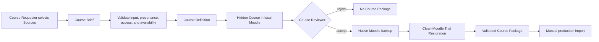

# FX Learning Course Generation

This repository turns a human-authored JSON Course Brief into a reviewable
Moodle Course and a validated native Course Package. Validation includes a clean
Moodle restoration and a learner-session check of the restored Course. The local
stack uses Moodle 5.0.3, MariaDB, standard Moodle components, and no production
credentials.

## Workflow



The Course Requester remains responsible for selecting educationally suitable
Sources. The automation validates and assembles those Sources but does not
discover or choose them.

## Run the complete Course Brief to Course Package workflow

Python 3.11 or newer and Docker Compose v2 are required. The workflow needs no
catalog, Azure, or production Moodle credentials.

Start from the committed Course Brief example. In addition to the Course topic,
audience, entry level, language, intended learning outcome, and learning-time
budget, it records each human-selected Source's exact title, short Learning
Activity name for Moodle navigation, URL, publisher, provider
identifier, type, language, duration, and free-access evidence. Supported Source
types are `article`, `blog`, `video`, and `course`; Course and Source language is
`en-US`, and entry level is beginner, intermediate, or advanced. Each selected
Source also records `activity_duration_minutes`, the complete learner time for
its Source Activity including the work required by its instructions.

For an editorially designed Course, the Brief can also provide
`course_description`, an ordered `learning_path`, and activity-specific
`activity_purpose` and `activity_instructions` on every Source. Each learning
path module supplies its short `name`, learner-facing `introduction`, and an
ordered list of Source `provider_item_id` values. The generator validates that
every selected Source appears exactly once and that the Source Activities use
the complete learning-time budget. Briefs without a `learning_path` remain
supported and use the automatic Foundations/Practice grouping.

One command validates the Brief and Sources, writes the reviewable Course
Definition, generates the hidden local Moodle Course, waits for the Course
Reviewer's decision, creates the native Course Package, and trial-restores it in
a clean Moodle 5.0.3 instance:

```bash
mkdir -p output/copilot-studio-basics

bin/course-package build \
  --brief examples/copilot-studio-course-brief.json \
  --definition-output output/copilot-studio-basics/course-definition.json \
  --output output/copilot-studio-basics/course-package.mbz
```

The command rejects an empty Source list, missing provenance, unsupported Source
types, non-English content, paid Sources, Source Activities shorter than their
Sources, a combined activity duration above the learning-time budget, and
unavailable URLs. It records the supplied provenance and current availability
evidence in the generated Course Definition, then turns the ordered Sources into
guided Source Activities with activity-specific purpose and instruction text.
When the Brief includes a designed learning path, it preserves the specified
module and Source order instead of inferring a phase from Source titles.
Module and Source Activity names are limited to 40 characters so breadcrumbs,
previous/next controls, and activity navigation remain scannable; full Source
titles remain unchanged in each activity's content and provenance. Each Source
Activity uses the global learner-visible renderer described in
`docs/source-activity-renderer.md`. Opening a Source does not mark its Source
Activity complete: the learner must return
to the Course and explicitly select Moodle's `Mark as done` action for each one.

Source availability, validation, rejection, Moodle generation, backup, and
trial-restore failures return non-zero and never report a validated Course
Package. The CLI prints both the Course Definition path and hidden local Course
URL before asking the Course Reviewer to type `accept` or `reject`. Use
`--accept` or `--reject` only for automation and tests.

To generate and inspect a Course Definition independently, stop before Moodle:

```bash
bin/course-definition build \
  --brief examples/copilot-studio-course-brief.json \
  --output output/copilot-studio-basics/course-definition.json
```

## Inputs, outputs, and repository layout

- `examples/copilot-studio-course-brief.json` is a small, runnable Course Brief.
- `examples/sample-course.md` is an editorial outline for the longer Copilot
  Studio course; it is reference material, not CLI input.
- `output/<course-slug>/` is the durable home for one Course's Brief, Course
  Definition, Course Package, and related generated files. Do not mix files for
  multiple Courses in the `output/` root.
- `artifacts/` is internal scratch space shared with the Docker containers. Build
  and verify commands replace files there, so it is not a durable output location.
- `tests/fixtures/` contains deterministic test inputs, not production-ready
  Course content.

Both build commands refuse to overwrite their requested output. Choose a new
path or move the previous artifact aside before rebuilding.

## Build and validate the Course Package

Docker and Docker Compose are required. From the repository root:

```bash
mkdir -p output/copilot-studio-practical-basics

bin/course-package build \
  --definition tests/fixtures/course-definition.json \
  --output output/copilot-studio-practical-basics/course-package.mbz

bin/course-package verify \
  --package output/copilot-studio-practical-basics/course-package.mbz \
  --definition tests/fixtures/course-definition.json
```

The first command starts the isolated source Moodle at <http://localhost:8080>,
validates the Course Definition, and generates a hidden Course for inspection.
The CLI prints the Course's direct review URL and two local-only logins. Use the
admin account to inspect Course settings and the enrolled review-learner account
to exercise learner navigation and the `Mark as done` control while the Course
remains hidden. These credentials are for the disposable Docker environment and
must never be used in production.
It then waits for the Course Reviewer to type `accept` or reject the result.
Acceptance creates a native backup without user data and immediately restores it
at <http://localhost:8081>; the output path is populated only after that trial
restoration verifies learner-visible behavior. `--accept` and `--reject` provide
the same explicit decision for automation. The separate `verify` command repeats
the clean-Moodle trial restoration for an existing Course Package. Any invalid
definition, rejection, generation, backup, restore, or verification failure exits
non-zero and does not report the Course Package as validated.
Build also refuses to overwrite an existing output path, preventing a stale or
previously validated package from being confused with the current run.

The Course Definition records Course identity and settings, the original Brief,
the general introduction, ordered modules, and each Source Activity's name,
purpose, instructions, total duration, and complete Source provenance, access,
duration, and availability evidence. The committed fixture is a complete
contract example.

Reset both isolated environments with `bin/course-package down`.

Run the complete repository test suite with `tests/all.sh`. It builds the Moodle
image, validates Brief and Course Definition failure cases against the exact PHP
contract used by packaging, and runs the full native backup, clean restoration,
learner visibility, and manual-completion round trip. The suite uses Docker and
the local ports `8080` and `8081`.

## Manual production import

In a compatible Moodle 5.0.x site, open **Site administration → Courses →
Restore course**, upload the `.mbz`, and restore it as a new Course in the
desired category. Keep the Course hidden, inspect its sections and Source as a
learner, and publish it only after review. Confirm patch-level compatibility and
site permissions first. This workflow neither needs production credentials nor
imports or publishes automatically.
