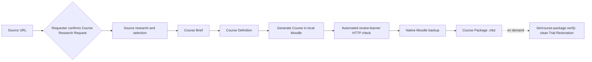

# FX Learning Course Generation

Create an internal learning course from a single source URL, review it in a
local Moodle, and produce a validated Moodle Course Package (`.mbz`). The recommended entry
point is the repository-local `create-course` agent skill.

The workflow is designed for company employees who have a source URL for the
topic but do not need to know the Course Brief JSON schema or Moodle backup
internals.

## What you get

For each Course, the workflow keeps the following artifacts together in
`output/<course-slug>/`:

- a Source Research Dossier with the evaluated Source Candidates and the Sources
  the agent selected;
- a JSON Course Brief containing the selected Sources and any reference videos;
- a reviewable JSON Course Definition;
- a Moodle-native Course Package (`.mbz`), generated and automatically
  smoke-checked; run `bin/course-package verify` for a clean-restore proof.

Every Course has the same fixed five-activity structure — a course overview, a
link to the entered URL, a reference-video page, a certification-upload
assignment, and a discussion forum. See
[docs/course-structure.md](docs/course-structure.md).

The resulting package uses standard Moodle components and contains no user data.
It is intended for manual restoration into a compatible Moodle 5.0.x site.

## Quick start with `create-course`

### 1. Clone the repository

You need access to the private `fusionAIx-TechPack` GitHub organization, Python
3.11 or newer, Docker, and Docker Compose v2.

```bash
git clone https://github.com/fusionAIx-TechPack/fx-learning-agent.git
cd fx-learning-agent

python3 --version
docker compose version
docker info
```

The Python tools use the standard library, so there is no separate package
installation step.

### 2. Start your coding agent in the repository root

If you use Codex CLI, start it after changing into the cloned repository:

```bash
codex
```

You can also open the checked-out repository folder in the Codex app. Ask the
agent to use the repo-local skill. The skill name is `create-course` with a
hyphen. As the Agent Prompt, enter the URL of the source you want the Course
built around — or a list of URLs, one per line, or an attached spreadsheet
(`.xlsx`/`.csv`) with a column of source URLs, to build several courses in that
order (one course per URL, each in its own `output/<slug>/`):

```text
$create-course

https://academy.pega.com/topic/generative-ai-pega/v1
```

The agent inspects that URL and proposes a Course Name, Course Overview, Course
Duration, Level, Language, and Audience for you to confirm before it researches
Sources. The conversation may be in Polish, but the generated Course and all
selected Sources currently use English (`en-US`). See the full flow and resume
examples in [Using the `create-course` skill](docs/create-course.md).

### 3. Make the one human decision

The agent automates the technical work and pauses at a single gate:

| Gate | What the agent provides | What you decide |
| --- | --- | --- |
| Course Research Request | A proposed Course Name, Overview, Duration, Level, Language, and Audience derived from your URL | Confirm or correct it before research starts |

The agent then researches and selects the free Sources itself, sized to the
confirmed Course Duration, and packages the Course unattended. Its own review of
the generated Course Definition is the quality gate on the Source selection
(see [ADR-0005](docs/adr/0005-automated-packaging.md)).

### 4. Receive the package

The build stands up a local Moodle, generates the Course, runs an automated
review-learner HTTP check that the five activities render with working manual
completion, and writes the `.mbz`. It does **not** run clean-Moodle Trial
Restoration — the `.mbz` is code-generated and smoke-checked but not
restore-tested. Run `bin/course-package verify --package … --definition …` for
that proof (recommended before any production import).

The agent will hand off the exact paths, normally similar to:

```text
output/pega-constellation-introduction/
├── source-candidates-2026-08-18.md
├── course-brief.json
├── course-definition.json
└── course-package.mbz
```

The `.mbz` restores into a Moodle course whose single content section holds a
**Course overview** page, a **URL** activity that opens the entered link in a
new window, a **Watch reference videos** page, a **Submit Course
Certification** assignment, and a **Discussion Forum**.

## What the `create-course` skill does

The skill runs or resumes the complete workflow:



It validates Source provenance, free access, availability, supported Source
types, language, durations, and the Course Duration. It preserves full external
Source titles as link text and assembles the fixed five-activity structure from
the selected Sources.

Opening a Source never completes an activity: the overview, the link, the
reference-video page, and the discussion forum require an explicit *Mark as
done*, and the certification assignment completes only when the learner submits
a file. The
skill does not publish a Course or connect to production Moodle. Those
boundaries are intentional. The detailed operating guide is in
[docs/create-course.md](docs/create-course.md).

## Manual CLI workflow

Use the CLI directly when you already have an approved Course Brief or Course
Definition.

### Read source URLs from a spreadsheet

```bash
bin/course-urls "input/Agent- Multiple course links.xlsx"
bin/course-urls input      # use the single spreadsheet in input/
```

Prints one URL per line, in row order — the first `http(s)` value in each row,
so the column name is irrelevant and a header row is skipped. Accepts `.xlsx`,
`.csv`, or a directory containing exactly one of them. The `create-course`
workflow uses this to turn an attached spreadsheet into the same ordered list
as a pasted one; in the skill you can reply `build from input` to run it against
`input/`.

### Build and inspect a Course Definition

```bash
mkdir -p output/copilot-studio-basics

bin/course-definition build \
  --brief examples/copilot-studio-course-brief.json \
  --output output/copilot-studio-basics/course-definition.json
```

The runnable example shows the complete Brief shape, including each selected
Source's exact title, short `activity_name`, URL, publisher, provider identifier,
type, language, Source duration, total activity duration, and free-access
evidence.

### Package an approved Definition

```bash
bin/course-package build \
  --definition output/copilot-studio-basics/course-definition.json \
  --output output/copilot-studio-basics/course-package.mbz \
  --accept --skip-restore
```

This stands up a local Moodle, generates the Course, runs the automated
review-learner HTTP check, and writes the `.mbz` unattended (~1 minute). Run
`bin/course-package down` afterward.

Flags:

- `--accept` skips the interactive review pause. Omitting it (and `--reject`)
  prints the staged Course URL at <http://localhost:8080> with disposable
  reviewer/learner logins and waits for you to type `accept` or `reject`.
- `--skip-restore` stops once the `.mbz` exists and skips clean-Moodle Trial
  Restoration. Omitting it runs the restoration inline.
- `--reuse` keeps the existing Moodle install instead of wiping every volume;
  later runs in a session start in seconds.

The `.mbz` produced with `--skip-restore` is not restore-tested. Prove it with:

```bash
bin/course-package verify \
  --package output/copilot-studio-basics/course-package.mbz \
  --definition output/copilot-studio-basics/course-definition.json
```

### Build directly from an approved Brief

```bash
bin/course-package build \
  --brief examples/copilot-studio-course-brief.json \
  --definition-output output/copilot-studio-basics/course-definition.json \
  --output output/copilot-studio-basics/course-package.mbz
```

### Verify an existing package

```bash
bin/course-package verify \
  --package output/copilot-studio-basics/course-package.mbz \
  --definition output/copilot-studio-basics/course-definition.json
```

Both build commands refuse to overwrite an existing requested output. Use a new
versioned filename for another attempt so previous evidence remains intact.

## Repository layout

- `.agents/skills/create-course/` contains the recommended agent workflow.
- `examples/copilot-studio-course-brief.json` is a runnable Course Brief.
- `examples/sample-course.md` is editorial reference material, not CLI input.
- `output/<course-slug>/` is the durable home of one Course and its artifacts.
- `artifacts/` is replaceable scratch space shared with Docker containers.
- `course_research/` validates Sources and generates Course Definitions.
- `moodle-cli/` and `docker/` implement Moodle generation and verification.
- `tests/fixtures/` contains deterministic test inputs, not production Courses.

Keep the `output/` root free of loose files and never mix artifacts from
different Courses in one Course directory.

## Operations and validation

The Moodle environments use fixed local ports:

- `8080` — staged Course review;
- `8081` — clean Trial Restoration.

Run only one Course build or full test suite at a time. After the reviewer no
longer needs either local Moodle environment, stop them with:

```bash
bin/course-package down
```

This removes the disposable local Moodle environments, not the durable files in
`output/`.

### Faster cold builds

Every full build stands up two clean Moodle sites, and the first start of each
runs a multi-minute `install_database.php`. Two ways to avoid paying it:

- `bin/course-package build ... --reuse` keeps the existing install between runs
  and resets only the Course. Fastest once the environment is warm.
- `bin/build-moodle-seed` (run once) captures a pre-installed Moodle database to
  `docker/mariadb-seed/moodle.sql.gz`. MariaDB imports it on every fresh volume,
  so even cold builds and `bin/course-package down` cycles skip the install.
  Re-run it after changing `docker/moodle` or the Moodle version; delete the
  file to return to installing from scratch. The snapshot is a local cache and
  is not committed.

Run the complete repository test suite with:

```bash
tests/all.sh
```

The full suite rebuilds and resets Docker test environments and volumes. Do not
run it while another Course build or review is active.

## Manual production import

Production import is outside the automated workflow. In a compatible Moodle
5.0.x site, open **Site administration → Courses → Restore course**, upload the
validated `.mbz`, and restore it as a new Course. The package restores the
Course visible; inspect it as a learner and set visibility to suit the
destination site. Confirm the target site's patch-level compatibility and
permissions first.

The repository does not require, collect, or store production Moodle
credentials.
