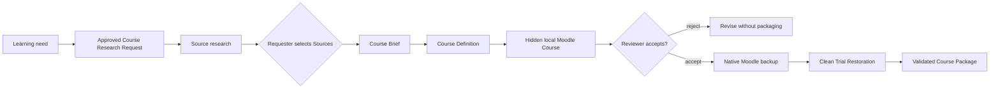

# Modified fx-learning-agent as below:
1. Necessary changes are made to script files that creates needed output of mbz file with 5 Moodle activities - Course summary and instruction, url to course, relevant videos, assignment for proof of completion and forum for discussion.
2. on $create-course - the prompt will ask user only to enter url/list of urls/excel sheet containing the urls(Source ur as header column)
3. The Agent will read urls and provides the required course name in below format as an example
Course Name:     AI Concepts for Developers and Technology Professionals
  Course Overview: Explain core AI concepts and terminology across generative AI
                   and agents, natural language processing, speech, computer
                   vision, information extraction, and retrieval-augmented
                   generation, and use them to reason about AI workloads and plan
                   AI solutions.
  Course Duration: 231 minutes  (Microsoft Learn's stated path duration; sum of
                   the 7 module times)
  Level:           beginner
  Language:        en-US
  Audience:        Developers and technology professionals starting with AI
4. User can confirm and the Agent start building the required mbz file. If there are list of urls supplied as in step-1. The agent creates separate folders under output and the relevant output files(jsons,.mbz) respectively.
5. The course genration time has been reduced. Now for single course it takes 2 mins in local as necessary changes were made to the folder script files to remove dependencies like review, backup, restoration and learner verification. Just because this is not made for production. And for 3 courses generation from excel it took approx 4 to 5mins. _Tested in local_

-----------------------Below contains more details on the **original** folder of fx-learning-agent----------

# FX Learning Course Generation

Create an internal learning course from an idea, review it in a local Moodle,
and produce a validated Moodle Course Package (`.mbz`). The recommended entry
point is the repository-local `create-course` agent skill.

The workflow is designed for company employees who know the learning need but
do not need to know the Course Brief JSON schema or Moodle backup internals.

## What you get

For each Course, the workflow keeps the following artifacts together in
`output/<course-slug>/`:

- a Source Research Dossier with evaluated Source Candidates and the human
  selection;
- a JSON Course Brief containing only the selected Sources;
- a reviewable JSON Course Definition;
- a Moodle-native Course Package (`.mbz`) after review and Trial Restoration.

The resulting package uses standard Moodle components and contains no user data.
It is intended for manual restoration into a compatible Moodle 5.0.x site.

## Quick start with `create-course`

### 1. Clone the repository

You need access to the private `fusionAIx-TechPack` GitHub organization, Python
3.11 or newer, Docker, and Docker Compose v2.

```bash
git clone https://github.com/fusionAIx-TechPack/fx-learning-agent.git
cd fx-learning-agent

python3 --version
docker compose version
docker info
```

The Python tools use the standard library, so there is no separate package
installation step.

### 2. Start your coding agent in the repository root

If you use Codex CLI, start it after changing into the cloned repository:

```bash
codex
```

You can also open the checked-out repository folder in the Codex app. Ask the
agent to use the repo-local skill. The skill name is `create-course` with a
hyphen. For example:

```text
$create-course

Create a beginner Course called "Introduction to Pega Constellation" for
developers who know Pega but are new to Constellation. The intended outcome is
to explain the architecture and build a first view. The learning-time budget is
90 minutes. Cover architecture, views, fields, and debugging.
```

The conversation may be in Polish, but the generated Course and all selected
Sources currently use English (`en-US`). See the full prompt template and resume
examples in [Using the `create-course` skill](docs/create-course.md).

### 3. Make the two human decisions

The agent automates the technical work but deliberately pauses at two gates:

| Gate | What the agent provides | What you decide |
| --- | --- | --- |
| Source selection | 5–10 researched, free Source Candidates with evidence and a recommended order | Select the exact Sources and their order |
| Course review | A hidden Course in local Moodle with reviewer and learner access | Type `accept` or `reject` after inspecting it |

Source Candidates never become Course content automatically. The Course
Requester selects them, and the Course Reviewer makes the packaging decision.

### 4. Receive the validated package

After `accept`, the build creates the `.mbz`, restores it in a clean Moodle at
<http://localhost:8081>, and verifies learner-visible behavior. A package is
reported as validated only after that Trial Restoration succeeds.

The agent will hand off the exact paths, normally similar to:

```text
output/pega-constellation-introduction/
├── source-candidates-2026-08-18.md
├── course-brief.json
├── course-definition.json
└── course-package.mbz
```

## What the `create-course` skill does

The skill runs or resumes the complete workflow:



It validates Source provenance, free access, availability, supported Source
types, language, durations, and the Course time budget. It also keeps navigation
labels short, preserves full external Source titles, and generates guided Source
Activities with explicit manual completion.

The skill does not choose Sources for the requester, treat opening a Source as
completion, publish a Course, or connect to production Moodle. Those boundaries
are intentional. The detailed operating guide is in
[docs/create-course.md](docs/create-course.md).

## Manual CLI workflow

Use the CLI directly when you already have an approved Course Brief or Course
Definition.

### Build and inspect a Course Definition

```bash
mkdir -p output/copilot-studio-basics

bin/course-definition build \
  --brief examples/copilot-studio-course-brief.json \
  --output output/copilot-studio-basics/course-definition.json
```

The runnable example shows the complete Brief shape, including each selected
Source's exact title, short `activity_name`, URL, publisher, provider identifier,
type, language, Source duration, total activity duration, and free-access
evidence.

### Stage, review, and package an approved Definition

```bash
bin/course-package build \
  --definition output/copilot-studio-basics/course-definition.json \
  --output output/copilot-studio-basics/course-package.mbz
```

The command prints the hidden Course URL at <http://localhost:8080> and
disposable local reviewer and learner credentials. Keep the process running,
inspect the Course, then type `accept` or `reject` in the waiting terminal.
Opening a Source does not complete its Source Activity; verify that the learner
must explicitly select Moodle's **Mark as done** action.

Use `--accept` or `--reject` only for tests or explicitly requested automation.
They are not evidence of a genuine human Course review.

### Build directly from an approved Brief

```bash
bin/course-package build \
  --brief examples/copilot-studio-course-brief.json \
  --definition-output output/copilot-studio-basics/course-definition.json \
  --output output/copilot-studio-basics/course-package.mbz
```

### Verify an existing package

```bash
bin/course-package verify \
  --package output/copilot-studio-basics/course-package.mbz \
  --definition output/copilot-studio-basics/course-definition.json
```

Both build commands refuse to overwrite an existing requested output. Use a new
versioned filename for another attempt so previous evidence remains intact.

## Repository layout

- `.agents/skills/create-course/` contains the recommended agent workflow.
- `examples/copilot-studio-course-brief.json` is a runnable Course Brief.
- `examples/sample-course.md` is editorial reference material, not CLI input.
- `output/<course-slug>/` is the durable home of one Course and its artifacts.
- `artifacts/` is replaceable scratch space shared with Docker containers.
- `course_research/` validates Sources and generates Course Definitions.
- `moodle-cli/` and `docker/` implement Moodle generation and verification.
- `tests/fixtures/` contains deterministic test inputs, not production Courses.

Keep the `output/` root free of loose files and never mix artifacts from
different Courses in one Course directory.

## Operations and validation

The Moodle environments use fixed local ports:

- `8080` — hidden Course review;
- `8081` — clean Trial Restoration.

Run only one Course build or full test suite at a time. After the reviewer no
longer needs either local Moodle environment, stop them with:

```bash
bin/course-package down
```

This removes the disposable local Moodle environments, not the durable files in
`output/`.

Run the complete repository test suite with:

```bash
tests/all.sh
```

The full suite rebuilds and resets Docker test environments and volumes. Do not
run it while another Course build or review is active.

## Manual production import

Production import is outside the automated workflow. In a compatible Moodle
5.0.x site, open **Site administration → Courses → Restore course**, upload the
validated `.mbz`, and restore it as a new hidden Course. Inspect it as a learner
and publish only after the organization's production review. Confirm the target
site's patch-level compatibility and permissions first.

The repository does not require, collect, or store production Moodle
credentials.
